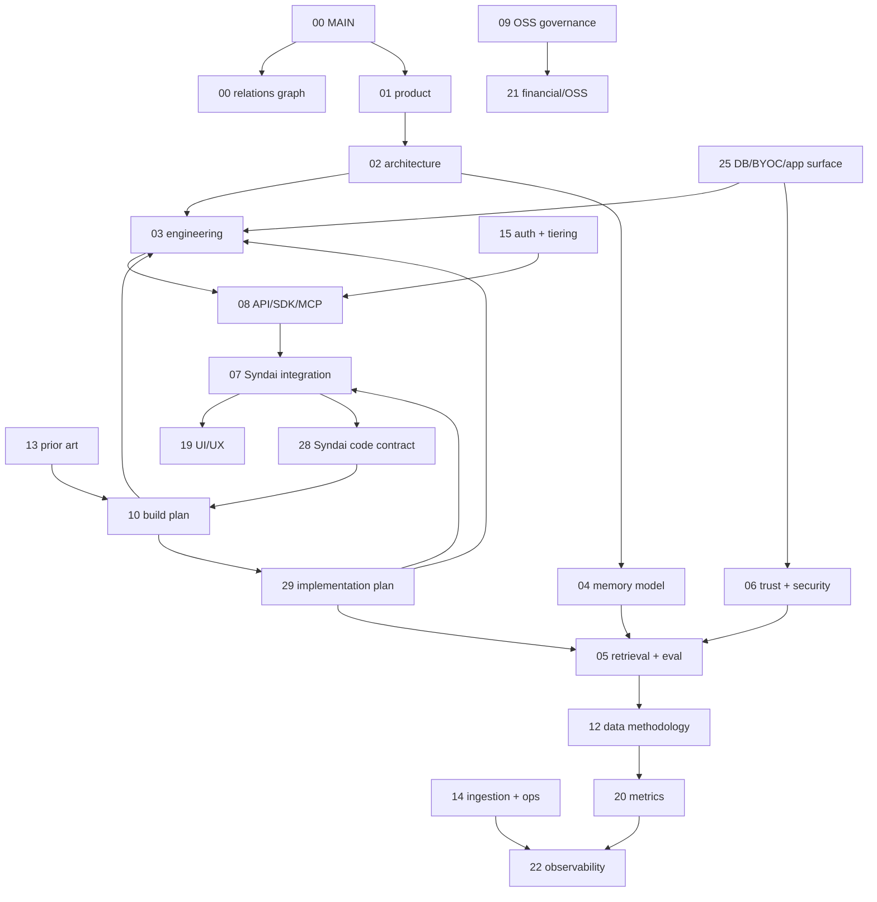

# MemPhant - Relations Graph

> This doc prevents the suite from becoming a pile of disconnected prose. It defines ownership, dependency order, frozen contracts, and the rules for changing one doc without drifting the others.

---

## 0. Canonical Dependency Graph

## 1. Ownership Rules

| Contract | Owning doc | Docs that may reference it |
|---|---|---|
| Product promise and launch gates | `00-MAIN-spec.md` | all |
| Doc DAG and frozen interface list | `00-relations-graph.md` | all |
| User, buyer, and positioning | `01-product-spec.md` | business, GTM, UI |
| Runtime topology and component boundaries | `02-architecture-spec.md` | engineering, integration, ops |
| Repo layout, crate boundaries, local gates | `03-engineering-spec.md` | API, ops, build plan |
| Memory kinds and lifecycle | `04-memory-model-spec.md` | retrieval, trust, UI |
| Retrieval stages, traces, eval gates | `05-retrieval-and-eval-spec.md` | metrics, observability, benchmark inventory |
| Poisoning, trust, deletion, tenant isolation | `06-trust-security-spec.md` | DB, API, integration, legal |
| Syndai adapter and dogfood cutover | `07-syndai-integration-spec.md` | build plan, UI, tests |
| Syndai code-grounded cutover contracts | `28-syndai-code-contract.md` | integration, build plan, tests |
| Public API, SDK, CLI, MCP schema | `08-api-sdk-mcp-spec.md` | integration, auth, docs |
| Public repo governance and contribution rules | `09-open-source-governance-spec.md` | legal, financial, launch |
| Database provider, BYOC, app-surface rules | `25-db-provider-byoc-and-app-surface-spec.md` | engineering, trust, ops |
| Implementation order, exit packets, and activation gates | `29-implementation-plan.md` | build plan, engineering, integration, status |
| Refinement register (R-series) and candidate-lever register | `24-methodology-hardening-refinements.md` | all (audit trail) |
| Final decisions, non-goals, and the reopen tests | `26-decision-register.md` | all (register wins on conflict) |
| SOTA ladder rungs, launch gates, activation/disable rules | `27-sota-ladder-and-validation.md` | eval, build plan, implementation |
| One-page launch framing and positioning line | `frame.md` | product, GTM |
| Live progress state + the deterministic DONE definition | `STATUS.md` | all (state only — contracts stay with their owners) |

If a doc needs to change an owned contract, update the owner first, then references.

## 2. Frozen Interfaces

These are frozen before implementation because retrofitting them is a migration:

| Interface | Frozen shape |
|---|---|
| Memory identity | `tenant_id`, `scope_id`, `actor_id`, `agent_node_id`, `episode_id`, `memory_unit_id`, `resource_id`. **`actor_id` = provenance/source axis** (who/what produced it — user/agent/tool/web/system — drives trust + the §5 corroboration-independence gate; every observation has one). **`agent_node_id` = access-tree axis** (an agent's position + `level`, drives inheritance/L0-L1+ gating; nullable — only agent-authored observations have one). Disjoint roles, not a redundant pair. |
| Memory kind | `episodic`, `semantic`, `procedural`, `belief`, `resource` — **frozen-but-extensible**: every unit has exactly one kind (frozen); a new kind is a governed additive migration, not a rewrite (`04` §7, `25` §11c) |
| Episode lifecycle | `retention_tier` (`hot`/`warm`/`cold`) + `dedup_key`/`observation_count`; cold drops derived indexes, never the recoverable raw episode |
| Scope graph | Tenant-owned `ltree` adjacency hierarchy (`parent_scope_id` truth + cached `materialized_path`), depth ≤ 32; inheritance + grants via `scope_policy(scope×kind×min_level, direction inherit\|grant)`, deny-by-default; **no implicit sibling access** (a grant is an explicit row, never a `memory_edge`) (`04` §11.0) |
| Bitemporal facts | 4 clocks (`valid_from`/`valid_to`/`transaction_from`/`transaction_to`); transaction-time is **append-only** — `correct`/supersede/invalidate close the open generation (`transaction_to=now`) and INSERT a new one (`04` §7.3a); current generation = `transaction_to IS NULL` |
| Active freshness | `last_confirmed_at` + `freshness_due_at` on `memory_unit`; volatile facts use an indexed due scan (`refresh_stale_fact`), not a separate freshness queue (`04` §8.1, `14` §3) |
| Resource chunk | a chunk is a `kind='resource'` `memory_unit`; `embedding` keys on `memory_unit_id` (no chunk table); `resource.acl` is an in-stage narrowing gate (`04` §6.1) |
| Tenant residency | `tenant.region` set at creation, **immutable**; one deployment/cell = one region; cross-region is refused, migration is export→import (`25` §7b) |
| Evidence path | memory unit -> citation -> episode/resource/provenance |
| Write-path / consolidation | `reflect` job; contradiction signal (proximity + subject-key + valid-time overlap) -> `contradicts`/`supersedes` edge; source-*independent* corroboration gate for belief->semantic promotion |
| Trust path | source trust, actor trust, quarantine state, corroboration state (independence-required), policy decision |
| Retrieval trace | query, channels, candidates, scores, filters (incl. `filter_selectivity`), fusion, rerank, budget, citations, misses, `consolidation_lag` |
| Delete path | tombstone/delete request -> invalidation generation -> derived indexes/resources/exports |
| Eval case | seed corpus, query, expected memory IDs, expected citations, forbidden leaks, trace assertions |
| API contract | OpenAPI JSON Schema plus MCP input/output schemas |
| DB contract | dedicated DB or `memphant` schema, tenant columns, roles, indexes, migration ledger |
| Physical layout | `episode`/`memory_unit`/`memory_edge`/`embedding`/event-ledgers are `PARTITION BY HASH(tenant_id)` on a set-once-immutable modulus, `tenant_id` in every PK (`04` §7.0) — retrofitting partitioning post-launch is a full table rewrite for self-hosters |
| Schema evolution | additive-vs-breaking taxonomy + `schema_compat_revision` boot-floor + forward-compat read contract (`25` §11b/§11c) |

Everything else is covered by the frozen interfaces and must be implemented only behind the existing feature flags.

## 3. Build DAG

The operational owner for this order is `29-implementation-plan.md`; this section is the dependency sketch.

Dependency order is not timeline marketing. It is the order in which interfaces must exist:

1. Schema contracts and core Rust types.
2. Episode/resource write path.
3. Memory unit lifecycle and trust policy.
4. Hybrid candidate generation.
5. Fusion, budget assembly, citation path.
6. Retrieval trace persistence.
7. Golden eval runner.
8. HTTP API.
9. Python/TypeScript SDKs generated from OpenAPI.
10. MCP tool server.
11. Background consolidation jobs.
12. Syndai export adapter.
13. Syndai trace-compare adapter.
14. Public benchmark ladder.
15. Hosted/self-host/BYOC release packaging.

Do not build UI dashboards, broad adapters, Helm charts, or graph backends before steps 1-10 are demonstrably green.

## 4. Drift Rules

- No doc may introduce a new memory kind without updating `04`, `05`, `06`, `08`, and `20`.
- No doc may change the write-path consolidation contract (contradiction detection, corroboration independence, episodic dedup, `reflect`, retention tiers) without updating `04`, `02`, `05`, `06`, and `14`.
- No doc may introduce a new API verb without updating `08`, `03`, `05`, and `09`.
- No doc may introduce a DB provider or deployment mode without updating `25`, `03`, `06`, and `14`.
- No doc may change the physical-layout or schema-evolution contract (partition key, `tenant_id`-in-PK, `schema_compat_revision`, the additive-only taxonomy / read contract) without updating `04` §7.0, `02`, `03`, `25` §11b/§11c, and `09` §10; no migration is classified additive outside the `25` §11c taxonomy, and no breaking change lands without bumping `schema_compat_revision` and following the `09` §10 expand-contract window.
- No doc may add a SOTA or benchmark claim without adding the eval source, config requirements, and confidence/reporting rules in `05` or `12`.
- No doc may add a Syndai-specific noun to public MemPhant core. It must live in `07` as adapter vocabulary.
- No doc may cite Syndai backend behavior as a cutover requirement without updating `28`.
- No doc may add a mobile/web route without updating the relevant app `NAVIGATION.md` when implementation happens.

## 5. Rewrite Permission

The project is pre-production. Deleting or rewriting existing Syndai memory code is acceptable if the replacement:

- preserves or improves L0/L1+ access guarantees
- preserves citation/correction UX
- intentionally preserves or improves user-visible memory behavior
- passes focused memory regressions
- runs through trace comparison before cutover
- deletes replaced paths after contract gates pass

Do not preserve code for sentiment. Preserve invariants and target behavior.
