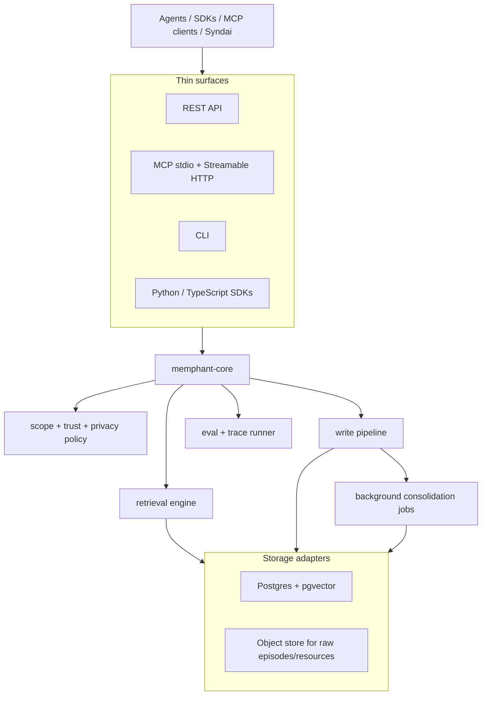

# MemPhant - System Architecture Spec

## 0. Shape

MemPhant is a Rust-first service and library with thin clients.



## 1. Service Topology

| Component | Language | Role |
|---|---|---|
| `memphant-core` | Rust | Memory model, policies, retrieval, traces, eval primitives. |
| `memphant-store-postgres` | Rust | SQLx/Postgres/pgvector adapter. |
| `memphant-server` | Rust | Axum REST API and admin endpoints. |
| `memphant-mcp` | Rust | MCP stdio and Streamable HTTP server (built on `rmcp`, the official MCP Rust SDK — `03` §3). |
| `memphant-cli` | Rust | Local import/export/eval/debug client. |
| `memphant-py` | Rust + Python | PyO3/maturin native binding and ergonomic Python client. |
| `memphant-ts` | TypeScript | HTTP client, types, examples. |

Rust owns deterministic kernels. Python/TS own developer ergonomics.

### 1.1 Axum Runtime Rules

The server uses boring Axum/Tower patterns:

- shared state is `State<Arc<AppState>>`
- every request carries a tenant/actor context produced by middleware
- timeouts are enforced at the Tower layer and at storage-call boundaries
- blocking file/blob operations run through bounded blocking pools or external object-store clients, never on the async executor
- request bodies have explicit size limits by endpoint
- all errors map into the public error envelope from `08-api-sdk-mcp-spec.md`
- background work is enqueued after durable raw capture; the HTTP handler does not wait for consolidation

No handler is allowed to reach around `memphant-core` policy checks.

### 1.1a Where CPU-Bound Work Runs

Mixing IO-bound (await Postgres) and CPU-bound (fuse/rerank) stages on the wrong runtime is how a Rust core silently loses its parallelism claim (`03` §0.1):

- **IO-bound stages 1–4 stay on tokio**, run concurrently via `tokio::try_join!` over independent `sqlx` queries (parallel candidate generation — the dominant read-path concurrency).
- **CPU-bound deterministic fusion (Stage 5) + rerank (Stage 6 default) run on `spawn_blocking`**, never inline, so a large fused set cannot stall the async reactor other tenants share. The PyO3 native-parallelism gate (`03` §6) asserts this same section releases the GIL.
- **Provider rerankers + L4 are `async` provider awaits** (balanced/exhaustive only, IO-bound, trace-labeled). The deterministic default path is the only one touching `spawn_blocking`.
- **Backpressure is a `tower::limit::ConcurrencyLimit`** at admission — request count can never exceed what the pools can serve; excess sheds as `429`+`Retry-After`, never unbounded queue growth. (Distinct from §3.1's `consolidation_lag`, which is *extraction* falling behind; both bounded, both traced.)

### 1.3 Connection and Pool Architecture

- **One shared `sqlx::PgPool` per role, not per tenant** (unbounded tenants would exhaust connections); isolation is query + RLS + partial index (`06` §6.1.1), never pool partitioning. `migrator`/`readonly`/`analyst` (`25` §3) get separate smaller pools.
- **GUC defaults at `after_connect`; per-query GUCs are `SET LOCAL`:** the vector stage's `hnsw.iterative_scan` tuning (`03` §5.2) is `SET LOCAL` inside the recall transaction so it reverts at commit and never leaks to the next borrower.
- **`DISCARD ALL` runs in sqlx `after_release`** — the structural backstop against cross-tenant session-state bleed (`06` §6.1.1), not a hoped-for discipline. (Documented caveat: connections sqlx opens internally to maintain `min_connections` return to the pool without invoking `after_release` — harmless here because they are fresh connections carrying no session state, but the backstop is "no *used* connection returns un-discarded," not a claim about every pool entry.)
- **Read-replica routing** splits the two workloads (`03` §0.1's real win): hot `recall`/`retain` → primary; eval/trace replay (`27`) + `analyst` quality-fact reads (`22`) → replica pool, so a 10M-token BEAM replay never starves live recall. `forget`-verification reads must hit the primary (post-generation-bump); replay tolerates replica lag (archived corpora are immutable).

### 1.2 Syndai Primitives Reused (grounding ledger)

MemPhant is a clean-room neutral product, but its hard parts are *proven* in Syndai's `backend/src/features/memory/` (72 modules, `syndai` schema — count re-verified 2026-07-02). The architecture mirrors the *shapes* (not the code or the names), so each component has a real precedent:

| MemPhant component | Proven Syndai precedent |
|---|---|
| retrieval engine (hybrid FTS+vector+RRF+rerank) | the memory hybrid-recall path + Matryoshka-512 embeddings (`MEMORY_EMBEDDING_DIMENSIONS`) |
| candidate-whitelist + central recall chokepoint (`04` §7.4) | `MemoryContextLoader` — the single audited recall entrypoint (`28` §2) |
| bitemporal semantic facts + supersession | `UserFact` (bitemporal, supersession self-FKs, `review_status`) |
| relational KG edges (no graph DB) | `MemoryEntity` / `MemoryFactEdge` (per-user nodes, typed bitemporal edges, ≤3-hop expansion) |
| deletion-generation forget path | `ScopedForgetService` + the ordered `MEMORY_ERASURE_TABLES` child-FK-first tuple |
| consolidation jobs | the memory job handlers + persona-evolution/refinement jobs |

The scheduling substrate for `reflect`/`tier_episode`/etc. mirrors Syndai's durable pattern — pg_cron → `pgmq` → Temporal with a dead-man's-switch heartbeat (`14` §scheduling) — not an in-process sleep loop.

## 2. Storage Defaults

Default store:

- Postgres 17/18 compatible (PG18 adds native `uuidv7()` — the PK type — async I/O that eases vacuum/seq-scan pressure, and B-tree skip scan; pgvector supports PG18 since 0.8.1).
- pgvector for dense vectors and HNSW — **pinned ≥ 0.8.4** (0.8.3/0.8.4, June 2026, fixed HNSW vacuum index corruption + maintenance errors; delete-heavy `forget` + per-partition HNSW put MemPhant squarely in that blast radius, R74).
- Postgres FTS for lexical retrieval. Do not call this BM25 unless a BM25 engine is actually added. FTS language/config is a per-tenant declaration, not an implicit English default (the Mem0 #4884 class).
- Object store for large raw blobs and resources.

Graph is not a default external dependency. The first public architecture uses relational `memory_edges`, recursive SQL where needed, and materialized 1-hop expansion tables for hot paths. An external graph database is rejected until benchmark traces prove relational edges are the limiting factor.

### 2.1 Index Strategy

V1 starts with simple, inspectable indexes:

| Query shape | Index rule |
|---|---|
| Tenant/scope lookup | leading `(tenant_id, scope_id)`; ancestor walk = GiST `ltree` `@>` on `(tenant_id, materialized_path)`, no hot-path recursion (`04` §11.0) |
| Valid fact lookup | `(tenant_id, scope_id, kind, valid_to)` partial index for live rows (`04` §7) |
| Episode recency | `(tenant_id, scope_id, happened_at desc)` |
| FTS | `tsvector` generated column with GIN index and tenant prefilter |
| Vector | HNSW per embedding profile (a **per-partition** index under `04` §7.0 hash partitioning), **partial on `embedding_profile_id`**; exact scan for tiny corpora. **Dim cap: `halfvec` HNSW ≤ 4,000 (`vector` ≤ 2,000)** — see §2.1a |
| Edges | explicit indexes on both `(tenant_id, from_memory_unit_id)` and `(tenant_id, to_memory_unit_id)` |
| Deletion/invalidation | `(tenant_id, deletion_generation)` on all derived stores |

`halfvec` storage (halves bytes vs `vector`, same recall) and the **`binary_quantize` two-phase pattern** are the recommended scale levers, not exotic complexity (§2.1a). `bit`/`sparsevec` remain benchmark-gated.

### 2.1a Vector index reality (pgvector, 2026)

Four facts that must be designed for, not discovered in production:

1. **HNSW index dim cap depends on the type: `vector` ≤ 2,000, `halfvec` ≤ 4,000, `bit` far higher.** MemPhant stores `halfvec`, so a model up to **4,000 dims (e.g. 3,072) indexes with `hnsw_full` directly** — the earlier "2,000 cap" was the `vector` cap and would have forced 3,072-dim models onto lossy slicing for no reason. `embedding_profile.index_strategy` (`03` §5 / `25` §4) is forced past `hnsw_full` only **above 4,000 dims**, or chosen earlier as a deliberate scale lever: `hnsw_full` (`halfvec` ≤ 4,000), `hnsw_subvector` (HNSW on `subvector(vec,1,2000)::halfvec(2000)` + full-vector rerank — **Matryoshka/MRL models only**; slicing a non-MRL embedding destroys recall), `hnsw_binary` (HNSW on `binary_quantize(vec)::bit(D)` + halfvec rerank). Each index is **partial on `embedding_profile_id`** and the vector query MUST carry `AND embedding_profile_id = $pid`, or the partial index is never chosen and recall silently falls to a seq scan; an active profile with neither a partial index nor `exact` is a db-lint failure.
2. **`halfvec` + `binary_quantize` two-phase — but ONLY at ≥ ~1024 dims, and always with rerank.** Store `halfvec` (2× smaller), index `binary_quantize(vec)::bit(D)` for a fast ANN first pass (~32× compressed), then rerank the top ~`20×k` by full `halfvec` distance. **Hard dimension floor: `hnsw_binary` is forbidden below ~1024 dims** — raw bit recall collapses (pgvector maintainer Katz, recall@10, ef_construction=256: 1536-d plateaus ~68% *without* rerank, **960-d = 0.00%**, 128-d ≈ 2.2–2.5%; Qdrant BQ docs: "poorer results for small embeddings i.e. less than 1024 dimensions"; arXiv:2603.23710: BQ+rerank "unable to reach 95% recall within reasonable search parameters" on 128-d sift10M, and 0.75× QPS — *slower* — on openai5M). The `index_strategy` selector forces `hnsw_full`/`hnsw_subvector`/`exact` below the floor. With rerank at ≥1536-d, binary recovers ~99% recall@10 at ef_search≈200 and is ~1.42× faster QPS / −33% p99 vs float — so it pays *only* in that regime, never as a blanket scale lever.
3. **Post-filter ANN starves on selective filters — `iterative_scan = relaxed_order` is the DEFAULT on the filtered vector stage, not optional.** pgvector applies the `WHERE` *after* the HNSW scan, so (README, verbatim) "if a condition matches 10% of rows, with HNSW and the default `hnsw.ef_search` of 40, only 4 rows will match on average." The retrieval engine sets `hnsw.iterative_scan = relaxed_order` on every filtered vector query (pgvector 0.8.0+; AWS Aurora measured "up to 100 times improvement in result completeness"), paying the documented cost (more CPU/memory/tail latency). **Recall under filtering is a budgeted resource, not free** — at very low selectivity IVFFlat can beat HNSW (arXiv:2602.11443, qualitative + system-dependent; not a fixed threshold), so a low-selectivity-dominant profile may instead need a dedicated engine (§2.1b).
4. **`sparsevec` storage supports up to 16,000 non-zero elements, but HNSW indexes support 1,000 non-zero elements** (no IVFFlat) — relevant only if learned-sparse embeddings are ever added, and the profile selector must reject an HNSW sparse index above the index cap.

**Partial-index count is bounded on purpose.** Per-profile partial HNSW indexes multiply as partitions × *active profiles*, and per-*attribute* filtering must NOT be modeled as one-index-per-value (Pinecone's yfcc-10M case: 200,000 tags → "200,000 indexes if partitioning was utilized" is the anti-pattern). Keep active embedding profiles few (a profile is a model+dim+strategy, not a tag); arbitrary metadata filters ride the `WHERE` + iterative_scan, never a dedicated index each.

**Choosing the embedding *model* (not just the index).** `embedding_profile` is provider-agnostic by design — MemPhant pins no specific model. The selection discipline: **do not pick by MTEB rank.** The memory-specific benchmark LMEB (arXiv:2603.12572) found MTEB↔agent-memory retrieval are near-orthogonal (Pearson −0.115; **−0.496 on dialogue** — mildly *anti*-correlated), its top performers are open models (bge-multilingual-gemma2, Qwen3-Embedding-8B), and "larger ≠ better." So a profile is validated on a memory benchmark before commit (`12`, `27` rung), and a memory-fine-tuned open model (HiNS-style, arXiv:2601.14857) is a candidate. Lock the instruction-setting (LMEB ranks swing wildly with vs without query instructions).

**Vectors are plaintext at rest by default.** An HNSW index must read plaintext vectors to compute `<=>` — ciphertext breaks distance (arXiv:2508.10373; privacy-preserving ANN needs HE/MPC/ORE/TEE/custom-graph schemes that are slower, leakier, less accurate, and "direct indexing over standard ciphertext is infeasible"). So encryption protects the **body** (`06` §6.1.1#5), and vector erasure is by tombstone+compaction, not by key destruction (`06` §6.2). The honest residual: a plaintext embedding is a *lossy* projection of the body (not zero-PII — embedding inversion can partially reconstruct), protected by tenant isolation + tombstone-GC, not by encryption. The **only** profile that may also encrypt the vector is `index_strategy=exact` (no HNSW; brute-force scan decrypts candidates in-process/TEE) — an opt-in, O(n) scan-only max-security profile for small/high-sensitivity corpora.

### 2.1b Tenant-filtered vector recall (the filtered-search Achilles heel)

Tenant isolation (`(tenant_id, …)`-leading queries) and vector recall ride on the **same** mechanism, and filtered HNSW is pgvector's documented worst case: it walks the graph *then* applies the filter, so a **highly selective tenant** (a small/new tenant inside a large shared index) surfaces graph neighbors that all fail the tenant filter and **recall silently collapses** — worst for exactly the day-one customer. The architecture must commit, not leave this implicit:

- **Under `04` §7.0 hash partitioning, every partition carries its own local HNSW index** — so the per-tenant-index win is structural, not a special case: a small tenant's vectors live in a partition with only ~`tenants/modulus` neighbors, and the planner prunes to that one partition's graph on `tenant_id = :t`. A single whale dominating its partition still escalates to `hnsw_binary` + corpus-size-aware `ef_search` within that partition. This also *strengthens* isolation (a pruned-away partition physically cannot return another tenant's rows).
- The shared-index path **mandates `iterative_scan` + a recall floor**, and the vector stage emits `filter_selectivity` and `iterative_scan_depth` as **trace fields** (`05` §3) so degraded recall is *visible*, never silent.
- Benchmark coverage adds a first-class dimension: **recall@k for a small tenant inside a large shared corpus** (`05` §5) — single-tenant golden corpora never catch this.

**Recall degrades *silently* as the corpus grows — so it is monitored, not assumed.** A controlled experiment showed HNSW recall@5 dropping ~10pt from 50k→200k vectors at a fixed `ef_search`, with **latency staying flat** — so the degradation is invisible to a latency dashboard. Two consequences: (1) `ef_search` is **corpus-size-aware** — it scales up as a tenant's corpus grows to hold a recall floor (the cost is latency, paid deliberately; raising `ef` is the lever, *not* a fixed value), and (2) **recall@k against a per-tenant golden set is a continuous SLI** (`22`), alarming when it crosses the floor, because nothing else surfaces the rot. The filtered-island effect is **engine-dependent** (some stacks show severe islands at high filter selectivity, others almost none), so MemPhant measures recall **at its own maximum filter selectivity on its own stack**, never assuming either result; at large scale the partial-per-tenant index or a DiskANN/ACORN-style filtered traversal is the escalation.

**The escape hatch is named, not hidden — a profile or tenant can be promoted to a dedicated vector engine.** pgvector is the default and is throughput-competitive to the largest tested scale (~50M vectors; the same TigerData benchmark also shows a dedicated engine winning p99 tail latency — so "stays on pgvector forever" is not promised). The 2026 market converges on either **specialized filtered-search** (Weaviate's ACORN filter strategy, arXiv:2403.04871, SIGMOD 2024) or **distributed partition-aware vector indexing** (Azure Cosmos DB's in-DB DiskANN, arXiv:2505.05885: < 20 ms over a 10M-vector index per partition, scaling to billions via auto-partitioning). So the recall path lives behind the `MemoryStore` interface (`03` §4) that can route a specific `embedding_profile` — or a promoted whale tenant (`04` §7.0) — to a **dedicated external vector engine** when its filtered-recall SLO can't be met on pgvector, without changing the public contract. The trigger is a **measured SLO breach on the filtered-recall sweep** (`05` §5), never corpus size alone.

### 2.2 Provider Assumption

The storage contract targets:

- plain Postgres for portability
- Neon for managed/eval/replay workflows
- Supabase for BYOC/local-app-platform workflows

Provider details live in `25-db-provider-byoc-and-app-surface-spec.md`. The architecture cannot assume PostgREST, Supabase Auth, Neon branching, or any browser-facing DB surface.

### 2.3 The Two-Store Split (what lives where, and the consistency contract)

Postgres and the object store hold disjoint data; the split is by *mutability and query shape*, not size alone.

| Postgres | Object store |
|---|---|
| every typed row (`episode`, `memory_unit`, `embedding`, `edge`, `citation`, `trust_event`, `trace`); small/hot episode bodies inline; all `halfvec` vectors (query targets) | raw episode bodies above the inline limit; resource blobs; cold-tier compressed blobs (`04` §2.4); archived eval-trace corpora + exports. **Never on a recall channel.** |

- **Content addressing:** blob key = `content_hash = sha256(bytes)`, stored as `episode.blob_hash`/`resource.content_hash`, laid out `tenant_id/<hash[:2]>/<hash>` so forget prefix-scopes and identical bytes dedup for free (the byte-level half of `04` §2.3). The adapter is the Apache-Arrow `object_store` crate (Apache-2.0, `26` §8) — S3/GCS/Azure/local are one config switch.
- **Cold-fetch never blocks recall:** stages 1–6 run on Postgres rows only; a blob is fetched at Stage 7 only when a citeable unit needs a raw snippet from a `warm`/`cold` episode, via the bounded IO pool, time-bounded — on miss/timeout the pack ships the unit + citation but **no snippet, labeled `evidence_cold`**, and enqueues `tier_episode` re-promotion (`04` §2.4). Degraded, never failed.
- **Consistency (the real failure mode) — one safe failure direction:** **write blob first, row second** (a crash leaves an unreferenced blob, swept by GC; a row pointing at a missing blob is *forbidden* — invariant #1); the **202 follows the row commit** (the row's existence is the durability guarantee). **Forget tombstones rows first, deletes blobs second** (`06` §6.2) so no crash leaves a live recall path to a deleted blob. `content_hash` is the reconciliation key for the ops completeness sweep (`14` §4).
- **The GC that makes "unreferenced blob is fine" safe** enumerates physical blobs from the transactional `blob_ledger` (`03` §5.1), **never `object_store.list()`** — so it tolerates the weakest provider list-consistency and only ever issues idempotent `DELETE(key)` — and applies a **`MIN_AGE` grace** (default 1h ≫ max write-txn): a blob younger than `MIN_AGE` is structurally uncollectible, which closes the PUT→commit window where the blob is unreferenced. The whole correctness proof is one inequality — `max_retain_txn ≪ MIN_AGE`, enforced by `statement_timeout`. Precedent: git-gc `--prune=2.weeks`, and the registry-GC "must be read-only" race this design avoids by marking from Postgres, not the bucket. The sweep is the `blob_gc_sweep` job (`14` §4); reference-counting is rejected (a count column is a second source of truth that drifts under crash — the reference set is derived from live rows). **MIN_AGE grace is race-resistant, not race-free, so GC adds a third fence beyond {reference-absence, age > MIN_AGE}: a generation/mark-window epoch** — the sweep records the `deletion_generation` it marked against and never collects a blob whose `blob_ledger` row was created or touched after the mark began, so a blob written *concurrently with* the sweep cannot be reaped. This is the content-addressed-GC stop-the-world hazard that bit the CNCF registry (GC deleted the live layers of an image uploaded mid-sweep → corruption, issues #4461/#3254; git uses a 2-week prune grace for the same reason); MemPhant's mark-from-Postgres + min-age + epoch-fence is the race-resistant form. Overwritten/superseded references are reconciled too (registry #2212) so orphans are reclaimed without touching a live blob.
- **Restore inverts the live ordering — Postgres PITR is authoritative, the bucket is reconciled to it, never rolled back.** Because blobs are content-addressed (`sha256`), a restore is a *presence* problem, not a version-merge: PG PITR to T1 fixes the reference set; every live `blob_hash` must be present in the bucket (else invariant #1 *across the restore boundary*), and any post-T1 blob is an orphan for normal GC. The `MIN_AGE` proof does **not** span a restore — `blob_gc_sweep` is suspended until the post-restore reconciliation sweep validates the reference set (`14` §4.2). **Object-store retention window ≥ Postgres PITR window** is the coupling that prevents a restore referencing a GC'd blob.

## 3. Write Path

### 3.0 Durability and Job-Delivery Contract

One synchronous durability point, an at-least-once tail:

- **One transaction, committed before the 202:** `{episode/resource row, caller-supplied initial units, the `reflect` enqueue}` commit together; the 202 follows. `retain` p95 < 200ms (`14` §7) covers this transaction + the preceding blob PUT, **not** extraction.
- **Enqueue is transactional** (pgmq send / `job_state` insert in-transaction, `14` §3.2) — no window where an episode is durable but unscheduled. This is the payoff over an in-process enqueue.
- **`reflect` jobs are at-least-once + idempotent, never exactly-once:** idempotency is the `(job_type, target_id, compiler_version)` key (`14` §3); a re-run re-derives the *same* candidate units (UUIDv7 derived deterministically from the key), so duplicate delivery is a no-op upsert.
- **Crash recovery is re-derivation, never reconstruction:** an episode stuck `captured` is recovered by re-running `extract_episode` from the durable raw blob — the same path as cold-tier re-derivation. The recoverable raw episode *is* the WAL; no in-memory replay queue.
- **Blob before row, ledger before txn:** the object-store PUT and a best-effort `blob_ledger` upsert (`state=present`, `created_at=now`) precede the row transaction; a crash there yields only a `MIN_AGE`-grace-protected orphan that `blob_gc_sweep` reaps (§2.3), **never** a row pointing at a missing blob (invariant #1). The atomic `{row, units, enqueue}` commit is expressed through the `MemoryStore` transaction seam (`03` §4) — three standalone `async fn`s would be three transactions and reopen the dual-write the contract forbids.

```text
client retain()
  -> authenticate tenant/actor
  -> validate scope and source trust
  -> store raw episode/resource first
  -> enqueue extraction/consolidation
  -> write initial memory units if caller supplied them
  -> emit trace and invalidation event
```

The write path is allowed to be partially async after raw capture. Losing an extraction job must not lose the episode.

### 3.1 Backpressure (the unmodeled failure mode)

Async consolidation has a saturation mode the spec must name: if extraction falls behind (provider rate-limited, cost spike, traffic burst), episodes pile up `captured` but un-`extracted`, and recall **silently degrades** because answer-bearing units do not exist yet. "Eventual completion under normal load" (`14` §7) does not define abnormal-load behavior, so:

- the extraction queue has a **bounded depth**; past the threshold, `reflect` sheds by demand tier (high-tier tenants first) and raises a `consolidation_lag` alarm.
- recall **declares the lag instead of hiding it**: the trace carries `consolidation_lag`, and when units are un-extracted the read path **falls back to episodic/lexical recall over raw episodes** and labels the result degraded — never a silent top-k miss.
- the accuracy-vs-cost choice under load (scale extraction = cost, or accept stale recall = accuracy) becomes an explicit, traced, alarmed decision, not an emergent surprise.

## 4. Read Path

```text
client recall()
  -> parse query and constraints
  -> apply tenant/scope/trust/privacy gates
  -> exact/entity lookup
  -> FTS candidates
  -> vector candidates
  -> temporal/edge expansion
  -> RRF fusion
  -> bounded rerank
  -> context budget assembly
  -> citations and trace
```

The live default path is bounded and deterministic. Provider-backed or heavier rerankers run only in `balanced`, `exhaustive`, or benchmark modes and are always trace-labeled.

**Hot-path latency SLO (falsifiable, validated at rung 3):** `fast`-mode recall targets **p50 < 200ms / p95 < 500ms** un-reranked on the reference corpus (companion to `retain` p95 < 200ms, `14` §7). "The hot path is cheap" is a number, not a vibe — the SLO is measured per release and a breach is a `27` §4 activation symptom, never silently absorbed.

Concurrent writers are safe by construction at the *index* layer: HNSW/heap integrity under parallel writes is Postgres MVCC/WAL's job (the Mem0 #4892 class — concurrent writers corrupting a bolt-on vector index — is structural in sidecar stores and absent here). Accumulator *semantics* under concurrency remain a separate, explicitly-solved problem: the §6.2 subject lease + the `04` §5.1a/§8.2 event-sourced ledgers.

### 4.1 Candidate Channels

V1 retrieval runs channels in parallel when possible:

| Channel | Purpose | Default |
|---|---|---|
| Exact/entity | Known subject/resource IDs, aliases, explicit refs | on |
| Lexical | Specific names, error text, commands, file paths | on |
| Vector | Paraphrase and semantic similarity | on |
| Temporal | Recent or time-windowed context | on |
| Relational edge | Contradictions, supersessions, source resources, procedure lineage | on for 1-hop |
| Query decomposition | Composite memory questions | on in balanced/exhaustive and benchmarks |
| Deliberate L4 recall | Expensive agentic search/reasoning over memory | explicit exhaustive mode |

Hybrid retrieval is table stakes. The architecture keeps each channel separately traceable so a failed benchmark can map to a lever.

### 4.2 Context Assembly

Recall returns a compact evidence pack, not unbounded memory:

1. citeable memory units first
2. short supporting snippets from episodes/resources when allowed
3. contradiction/staleness warnings
4. dropped-candidate reasons
5. trace reference for audit/debug

Memory text must be delimited as data. The caller runtime decides how to use it.

## 5. Background Jobs

Background jobs are idempotent and keyed by durable IDs:

- Episode chunking.
- Contextualization.
- Entity/fact extraction.
- Deduplication.
- Semantic consolidation.
- Procedure/strategy promotion.
- Contradiction checks.
- Trust reclassification.
- Decay/reinforcement updates.
- Re-embedding migrations.

No job relies on in-memory state for correctness.

### 5.1 Job Boundaries

| Job | Input | Output | Failure rule |
|---|---|---|---|
| `extract_episode` | episode/resource IDs | candidate units, entities, citations | retry; episode remains source of truth |
| `consolidate_semantic` | candidate facts/beliefs | semantic units, `supersedes`/`contradicts` edges | detect via subject-key+proximity+valid-overlap (`04` §3.1); promote only on **independent** corroboration (`04` §5); never overwrite silently |
| `promote_procedure` | successful/failed traces | procedural candidates | requires replay/validation before active use |
| `classify_trust` | source/actor/context facts | trust events and quarantine decisions | fail closed to lower trust |
| `decay_reinforce` | retrieval/review events | DSR state update (`fsrs-rs`) | best-effort; not on hot path |
| `refresh_stale_fact` | active units with `freshness_due_at <= now()` | confirmation observation, trust event, or supersession generation | no separate queue; due scan is bounded by `(tenant_id, freshness_due_at)` |
| `tier_episode` | episode age + recall frequency | `retention_tier` demotion/promotion (`04` §2.4) | reversible; never drops the recoverable raw episode |
| `reembed_profile` | embedding profile change | new embedding rows | compare new profile before switch; runnable offline from raw episodes; **claim un-embedded units in batches via `FOR UPDATE SKIP LOCKED` before the provider Batch call (§5.3) — the final `(unit, profile)` write is idempotent, but the provider cost is not** |
| `delete_generation` | forget/delete request | invalidated derived rows/blobs | release-blocking if incomplete |
| `reextract_on_miss` | trace-identified write-path miss + missed query | query-conditioned re-extraction of one episode (`04` §9, R80) | rung-gated (`miss_repair_extraction_enabled`); idempotent on `(episode_id, query_features_hash, compiler_version)`; per-tenant rate-capped |

Jobs are allowed to use heavier models. Raw capture and hot recall are not.

### 5.2 Extraction Robustness (one malformed item must not abort a batch)

The extraction LLM routinely emits schema-violating or truncated JSON, and the production failure is that **one bad item aborts the whole batch/episode** — Graphiti's tracker shows it repeatedly (`NodeResolutions ValidationError` on a missing field, #879; `ExtractedEntities` validation aborting ingestion, #796; token-limit truncation breaking dedup mid-parse, #760), and its v0.21.0 notes admit "significantly reduced the number of runtime errors when adding an episode." So `extract_episode`/`reflect` are hardened:

- **Validate-or-quarantine, never abort.** Each extracted item is schema-validated (the `schemars`/serde decode boundary); an invalid item is dropped to a quarantine for re-extraction, the rest of the batch proceeds. The raw episode is untouched (it is the recoverable source, so a failed extraction is always re-runnable).
- **Bisection retry on a failing batch (8→4→2→1).** A batch that fails (truncation, a poison item) bisects until the offending item is isolated and quarantined, so a single malformed memory never blocks the others (the production-proven Hindsight pattern, mirrored in `04` §9.3).
- **Output schema is provider-independent.** The decode contract does not depend on a provider's `response_format`/strict-JSON support; a provider that emits looser JSON degrades to the bisection path, it does not silently corrupt dedup.
- **An empty extraction result is not success.** A batch that yields zero candidates is distinguished from a batch that *failed* and swallowed the error (the Mem0 #5903 class returned `[]` for failures) — failures quarantine + alarm; a genuine zero-candidate episode records `extracted` with `candidate_count: 0`.
- **Degenerate embeddings are rejected at the write boundary.** Every vector is validated finite (no NaN/Inf) and dimension-correct for its profile before insert — a degenerate vector silently breaks near-dedup and propagates (the Graphiti #1505 class); rejection routes the item to the same quarantine as schema violations.

### 5.3 `reembed_profile` Work-Claim (don't pay the Batch-API bill twice)

The `(unit, embedding_profile)` PK (`04` §7) makes the *final write* idempotent — a redelivered re-embed overwrites the same row. But two workers that both claim the **same un-embedded units** both submit them to the provider Batch API (`14` §10.1) and **both pay the cost** — at BEAM-10M scale that is a doubled embedding bill, an economic bug the idempotent write hides. So the provider call is gated on a work-claim, not just the write:

- **Claim a batch of un-embedded units with `SELECT … FOR UPDATE SKIP LOCKED`** before submitting to the provider. The PostgreSQL docs sanction exactly this: `SKIP LOCKED` *"can be used to avoid lock contention with multiple consumers accessing a queue-like table"* — any unit another worker already claimed is skipped, so the two workers partition the un-embedded set instead of duplicating it. Claim by flipping a `reembed_claimed_at`/`reembed_job_id` marker (or inserting a `reembed_claim` row keyed `(unit_id, new_profile_id)`) inside the locking transaction, so the claim survives the (long) async Batch window after the row lock releases at commit.
- **Use the documented work-queue shape:** lock the **returned** rows at the top level (`… ORDER BY id FOR UPDATE SKIP LOCKED LIMIT :batch`), never `FOR UPDATE` inside a subquery — the docs warn the subquery form locks *all* scanned rows, and the LIMIT-vs-locking-clause ordering footgun otherwise over-locks. The claim transaction is short (mark rows, commit); the expensive 24h Batch call happens *after* commit against the already-claimed set.
- **Resumability is unchanged** — the `(job_type, target_id, new_profile_id)` `job_state` key (`14` §10.1) still resumes from un-embedded units; the claim marker just prevents two live workers from racing the *same* units. A worker that dies mid-Batch leaves a stale claim, swept back to un-claimed by the failed-job sweep (`14` §4.1) after `locked_until` lapses.

## 6. Deployment Modes

| Mode | Use |
|---|---|
| Library | Local experiments and embedded apps. |
| Single binary server | Small teams, demos, self-host. |
| Service cluster | Hosted MemPhant, Syndai production. |
| BYOC Postgres | Enterprise/customer-owned data. |

### 6.1 Multi-Node Topology and `reflect` Single-Flight

The "Service cluster" mode scales horizontally because every stateful concern lives in Postgres or the object store, never in a node:

- **The API tier is stateless and identical across nodes** — `AppState` holds only pools/config/clients, no per-tenant cache, no session affinity. Scaling is "add a node." The rejected `cache cluster` non-goal (`26` §7) is *why* this stays true.
- **The job runner is a separate `memphant-worker` deployable**, not an API thread — it owns the expensive-LLM `reflect` cost center, scales on queue depth; the API only *enqueues* transactionally (§3.0).
- **Periodic jobs are single-flight by the substrate, not leader election:** `tier_episode`/`update_decay`/sweeps fire from pg_cron → one pgmq message → one Temporal workflow (`14` §3.2). pg_cron schedules from the database, so N workers do not each run a cron loop — the single enqueue is the single-flight guarantee, with a `job_heartbeats` dead-man's-switch. No in-process scheduler, no Raft/etcd lease.
- **`reflect` concurrency is bounded per `(tenant, subject_key)` by a single-flight lease (§6.2), not globally locked.** Two jobs on the same `subject_key` race contradiction detection (`04` §3.1); the `(tenant, src, dst, kind)` edge uniqueness and the `(unit, embedding_profile)` PK make the *edge/embedding* writes safe no-op upserts, **but the non-idempotent accumulators they touch are not** — belief confidence (`04` §5.1), FSRS `stability_days` (`04` §8), and supersession `valid_to`/`state` are read-modify-writes that **double-apply under at-least-once delivery**. So same-subject concurrency is serialized by the §6.2 lease *and* the accumulators are made idempotent at the model layer (`04` §5.1a, §8.2, §3.4). Workers stay parallel **across distinct `subject_key`s** (the lease is per-subject, not per-tenant).
- **HA:** an API node dying drops only in-flight requests (nothing acked durable that wasn't committed); a worker dying re-delivers at-least-once jobs to a survivor (idempotent re-derivation, §6.2). Postgres is the single must-be-HA component — the provider's job (`25`), and the reason MemPhant keeps no second stateful store.

### 6.2 The `reflect` Single-Flight Claim/Lease (the at-least-once correctness floor)

The §6.1 bullet **as originally written was wrong**: it asserted edge-uniqueness + idempotency keys make two same-`subject_key` jobs "a safe no-op upsert." That holds only for the *idempotent* structures (edges, `(unit, profile)` embeddings); it is **false for the non-idempotent accumulators** the consolidation pipeline mutates (confidence, `stability_days`, `valid_to`). There is **no `FOR UPDATE`/`SKIP LOCKED`/advisory lock anywhere in the suite**, and `job_state.locked_until` (`14` §3.1) exists but was **never wired to a claim protocol**. This section is the fix; it wires `locked_until` and pins the mechanism.

**Two independent guarantees, do not conflate them:**

1. **Job-claim** (which *worker* runs a queued job) — owned by the pgmq visibility-timeout + `job_state` row (below).
2. **Subject single-flight** (only one `reflect` mutates a given `(tenant, subject_key)` at a time) — owned by a **transaction-scoped Postgres advisory lock** taken inside the `reflect` transaction.

**Mechanism for (2): `pg_try_advisory_xact_lock`, not `SELECT … FOR UPDATE SKIP LOCKED` on a claim row, not the pgmq vt.** The reasoning, grounded in the PostgreSQL docs:

- A `subject_key` is **not a row** — it is a derived `(scope_id, normalized_subject, predicate)` tuple (`04` §3.3) that may span *many* `memory_unit` rows and *zero* rows on first observation. `FOR UPDATE SKIP LOCKED` needs an existing row to lock; there is no single canonical row to lock for "this subject." Inventing a `subject_lock` table is a second source of truth to keep consistent. The advisory lock needs **no row**: `pg_try_advisory_xact_lock(hashtext(:tenant_id || ':' || :subject_key))` locks a *name*, present or not.
- **Transaction-scoped, never session-scoped.** Postgres: a transaction-level advisory lock is *"automatically released at the end of the transaction, and there is no explicit unlock operation."* A session-level `pg_advisory_lock` is *"held until explicitly released or the session ends"* and **does not honor transaction semantics** — on a pooled `sqlx::PgPool` (`§1.3`) a session lock leaks to the next borrower of that connection and is never released on a crash. **Session advisory locks are forbidden in MemPhant** (the §1.3 `DISCARD ALL`-on-release backstop does not unlock them deterministically; `pg_advisory_unlock_all` would be required and is a footgun). `*_xact_lock` releases on COMMIT/ROLLBACK/crash automatically — exactly the lease semantics we want.
- **`pgmq` vt alone is insufficient.** pgmq guarantees *"exactly once delivery of messages to a consumer within a visibility timeout"* and on crash the message *"become[s] visible again and can be read by another consumer"* — i.e. **at-least-once across vt expiry**. The vt serializes *delivery of one queue message*; it does **not** serialize *two different messages that happen to touch the same `subject_key`* (a `reflect` on episode A and a `reflect` on episode B, both mutating subject S). Subject single-flight is orthogonal to message delivery and must be its own lock.

**How `job_state.locked_until` wires in (it was dead; make it live):** the pgmq vt is the real lease for *job ownership*, and `job_state.locked_until = now() + vt` is its **observable mirror** — written when the job is claimed, so the failed-job sweep (`14` §4.1) and `job_heartbeats` dead-man's-switch (`§6.1`) can see a lease that has lapsed without an ack. A worker that holds the message past `locked_until` without heartbeating is treated as dead; the message redelivers (at-least-once), the new worker re-takes the xact advisory lock, and re-runs idempotently. `locked_until` is the *human/ops-visible* lease; the pgmq vt is the *enforced* one — they are set together and must not drift.

**The lease must outlive the work, or the lock is a lie.** A lease shorter than a `reflect` round (which makes expensive LLM extraction + contradiction-judge calls, `04` §9) means the vt expires mid-work, a second worker claims the same message, and **both run concurrently** — the exact race the lock was meant to stop, now *caused* by it. So: vt is sized to the **p99 `reflect` round duration with margin**, and long rounds **heartbeat** (extend the vt via `pgmq.set_vt` and bump `locked_until`) rather than picking one huge fixed vt. A round that cannot finish within a bounded number of heartbeats is parked to the DLQ (`14` §11), never looped forever.

**Lock granularity + giant-scope fairness (per `subject_key`, not per tenant).** The advisory key is **per `(tenant, subject_key)`**, never per tenant. A per-tenant lock would serialize *all* of a large tenant's consolidation behind one mutex — a Syndai-scale tenant with millions of subjects would process `reflect` single-threaded, starving fairness. Per-subject locking lets thousands of distinct subjects in one tenant consolidate in parallel while still serializing the genuinely-conflicting same-subject work. A pathologically hot single subject (every episode mentions it) is the one serialization point; that is correct — those *are* the jobs that conflict — and is bounded by demand-tier shedding (`§3.1`), not by widening the lock. `hashtext` collisions (two distinct subject keys hashing equal) only ever cause *extra* serialization, never a correctness loss, so the 32-bit space is acceptable; if collision-induced contention is ever measured, the two-`int`-key form `pg_try_advisory_xact_lock(hashtext(tenant)::int, hashtext(subject_key)::int)` widens it.

**Acquire-or-skip, never acquire-or-block.** `reflect` uses `pg_try_advisory_xact_lock` (non-blocking `try`), not `pg_advisory_xact_lock` (blocking). On a `false` return the job **requeues with backoff** (the other worker is already consolidating this subject; redelivery after vt re-attempts), so a worker is never parked holding a connection waiting on a subject lock — connection-pool exhaustion is a worse failure than a re-queue. This is the same "skip contended work, let it redeliver" discipline as `SKIP LOCKED`, applied to a name instead of a row. Never place `pg_try_advisory_xact_lock` in a `SELECT` target list with `LIMIT`/`ORDER BY` — the planner can acquire more locks than expected (PostgreSQL advisory-lock docs).

**The scale cliff — cap worker concurrency, monitor the right wait events.** Postgres-as-a-queue degrades at *thousands* of concurrent workers, not from the lock design but from **MultiXact SLRU contention + heap bloat + vacuum pressure** under `FOR UPDATE SKIP LOCKED` (EDB/Microsoft post-mortem, "Potential Consequences of Using Postgres as a Job Queue", 2026-05-04 — "works fine in dev and staging, then goes off a cliff in production"). So: (1) **cap `memphant-worker` reflect/reembed concurrency in the low hundreds per node**, scaling out by adding nodes, not threads; (2) the work queue is **pgmq** (archive-on-ack — acked messages move to an archive table, so claim/ack churn on the live queue stays bounded; pgmq's *partitioned* queues are opt-in via `pgmq.create_partitioned` and require the pg_partman extension — adopt only if measured churn demands it, R74; pgmq's FIFO grouped queues with message group keys exist as an alternative per-subject ordering lever, though the advisory-lock design above stands on its own) — never a hand-rolled `FOR UPDATE` loop over a growing jobs heap; (3) **monitor `LWLock:MultiXactMemberSLRU` and `LWLock:MultiXactOffsetSLRU`** (the real wait-event names — *not* a bare "MultiXactSLRU") as SLIs (`22`); their appearance is the cue to cap concurrency before the cliff; (4) implicit FK `FOR KEY SHARE` locks on hot rows inflate MultiXacts — keep them off the claim path. **Hot-subject escape:** if one `subject_key` is so active its serialized lease becomes the bottleneck, split the **hot "current-state" lane** (the latest belief, updated under the lease) from the **audit/recompute lane** (the append-only ledger fold, `04` §8.2) so reads never wait on recompute, and shard the subject finer. The serial section must stay short and the event-fold checkpointed (`04` §8.2), or correctness is traded for tail latency.

## 7. MCP

MCP exposes tools, not a giant API clone. Current MCP transports are stdio and Streamable HTTP, and servers declare the `tools` capability: <https://modelcontextprotocol.io/specification/2025-11-25/basic/transports>. **SSE is not a MemPhant launch transport** — new deployments expose stdio + Streamable HTTP only.

**`rmcp` implementation note (2.x — R74).** The `#[tool]` macro derives `inputSchema` from the parameter struct via `schemars`, but **does not auto-derive `outputSchema` from the macro alone**. The canonical path is returning the `Json<T>` wrapper on the canonical response type (the framework derives `outputSchema` from `T` and fills `structuredContent`); `Tool::with_output_schema<T>()` where `T: JsonSchema` is the fallback (`08` §5.1). Do not hand-author parallel schemas. Target rmcp 2.x.

V1 tools:

- `retain`
- `recall`
- `reflect`
- `correct`
- `forget`
- `trace`
- `mark` (outcome feedback — the `outcome_label` producer, `08` §1, R77)

Do not add `search` and `query` aliases. One verb per job (`mark` is feedback, a distinct job from `trace` inspection; user-facing memory *search* is `recall` with `breadth: search`, never a new verb).

Each MCP tool defines:

- `inputSchema`
- `outputSchema`
- human-readable text `content`
- machine-readable `structuredContent`
- resource references for large traces, resources, and episodes

Large traces are resources, not giant tool-return payloads.

## 8. Architecture Non-Goals

MemPhant is not:

- an agent runtime
- a workflow engine
- a governed-action approval system
- a vector database
- a graph database
- a task router
- a prompt framework
- a mobile sync engine

It is allowed to integrate with all of those. It should not become any of them.

## 9. Failure Modes and Levers

| Failure | First lever | Escalation lever |
|---|---|---|
| Correct memory never candidates | lexical/vector/entity channel tuning | query decomposition |
| Candidate appears but loses fusion | RRF weights, channel caps | learned reranker |
| Stale fact wins | validity/supersession policy | temporal graph expansion |
| Poisoned memory appears | source trust/quarantine | adversarial training/evals |
| Context overflows | budget policy and compression | L4 deliberate recall |
| Recall too slow | SQL/index shape and candidate caps | cache/materialized recall |
| Tenant leak risk | DB roles/RLS/grant tests | physical tenant isolation |
| Skill promotion unsafe | validation threshold | procedural compiler |
